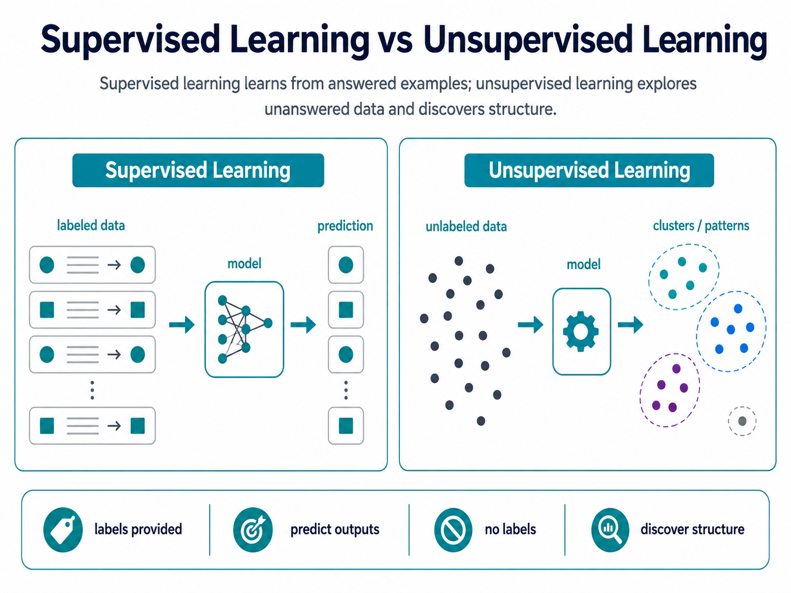

# Supervised learning

Supervised learning trains a model with examples that already include the known correct answers.

It learns the relationship between inputs and outputs so it can predict answers for new data.

## Unsupervised learning

Unsupervised learning trains a model with data that has no answer labels.

It tries to `discover` hidden structure, groups, patterns, or unusual points by itself.

## And the queen sentence:

Supervised learning learns from answered examples; unsupervised learning explores unanswered data and discovers structure.
