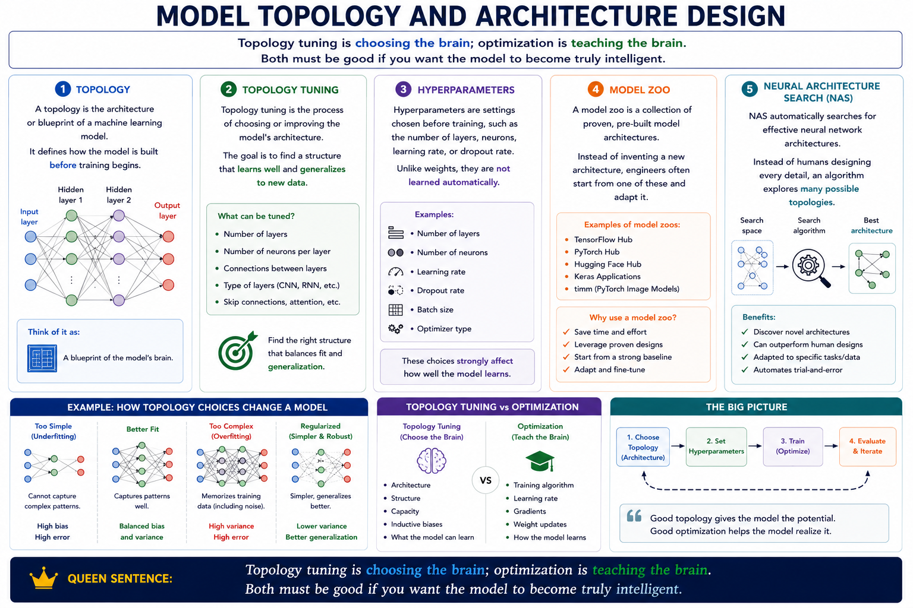

# Topology

A topology is the architecture or `blueprint` of a machine learning model.

It defines `how the model is built before training begins.`

## Topology tuning

Topology tuning is the process of choosing or improving the model's architecture.

The goal is to find a structure that learns well and `generalizes to new data.`

## Hyperparameters

Hyperparameters are settings chosen` before training`, such as:
* the number of layers
* neurons
* learning rate
* dropout rate
* etc

Unlike weights, `they are not learned automatically`.

## Model zoo

A model zoo is a collection of `proven`, `pre-built` model architectures.

Instead of inventing a new architecture, engineers often start from one of these and adapt it.

## Neural Architecture Search (NAS)

NAS `automatically` searches for `effective neural network `architectures.

Instead of humans designing every detail, an algorithm `explores` many possible topologies.

**Topology tuning is choosing the brain; optimization is teaching the brain. Both must be good if you want the model to become truly intelligent.**

