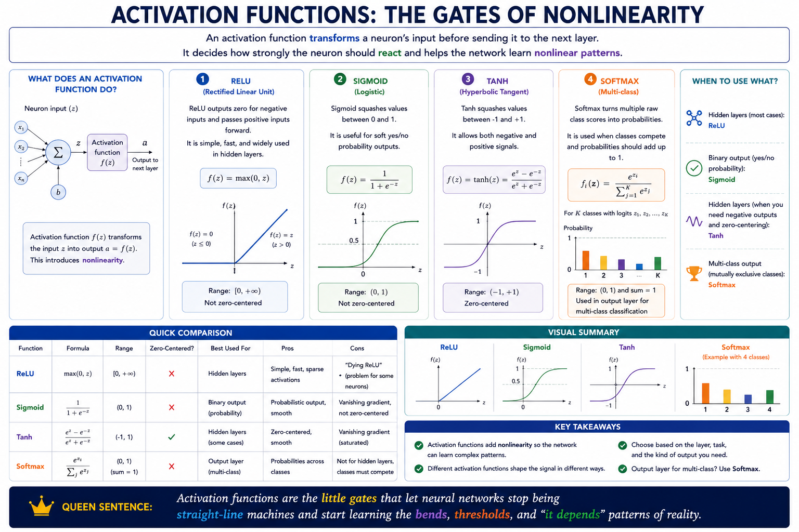
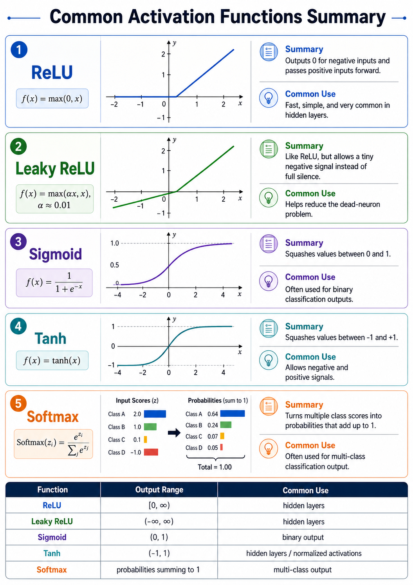

# Activation function

An activation function transforms a neuron’s input before sending it to the next layer.

It decides `how strongly the neuron should react` and helps the network learn `nonlinear` patterns.

## ReLU

ReLU outputs zero for negative inputs and `passes positive inputs `forward.

It is simple, fast, and widely used in hidden layers.

## Sigmoid

Sigmoid `squashes` values between `0 and 1`.

It is useful for soft `yes/no` probability outputs.

## Tanh

Tanh `squashes` values between `-1 and +1`.

It allows both negative and positive signals.

## Softmax

Softmax turns multiple raw class scores into `probabilities`.

It is used when classes compete and probabilities should add up to 1.

**Activation functions are the little gates that let neural networks stop being straight-line machines and start learning the bends, thresholds, and “it depends” patterns of reality.**

