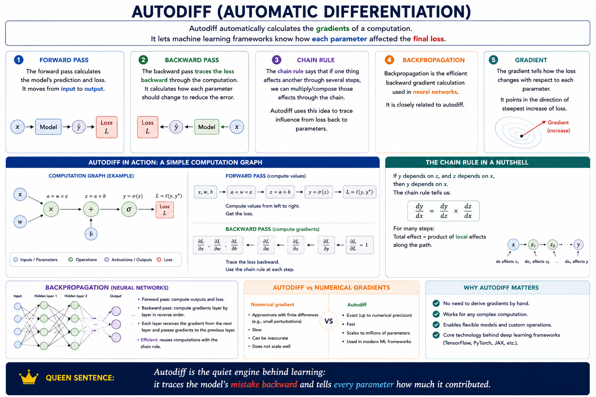

# Autodiff

Autodiff automatically calculates the gradients of a computation.

It lets machine learning frameworks know how each parameter affected the final loss.

## Forward pass

The forward pass calculates the model’s prediction and loss.

It moves from input to output.

## Backward pass

The backward pass traces the loss backward through the computation.

It calculates how each parameter should change to reduce the error.

## Chain rule

The chain rule says that if one thing affects another through several steps, we can multiply/compose those effects through the chain.

Autodiff uses this idea to trace influence from loss back to parameters.

## Backpropagation

Backpropagation is the efficient backward gradient calculation used in neural networks.

It is closely related to autodiff.

* So if gradient descent is: walk downhill through the loss landscape.
* then autodiff is: tell me which way downhill is.

**Autodiff is the quiet engine behind learning: it traces the model’s mistake backward and tells every parameter how much it contributed.”**

