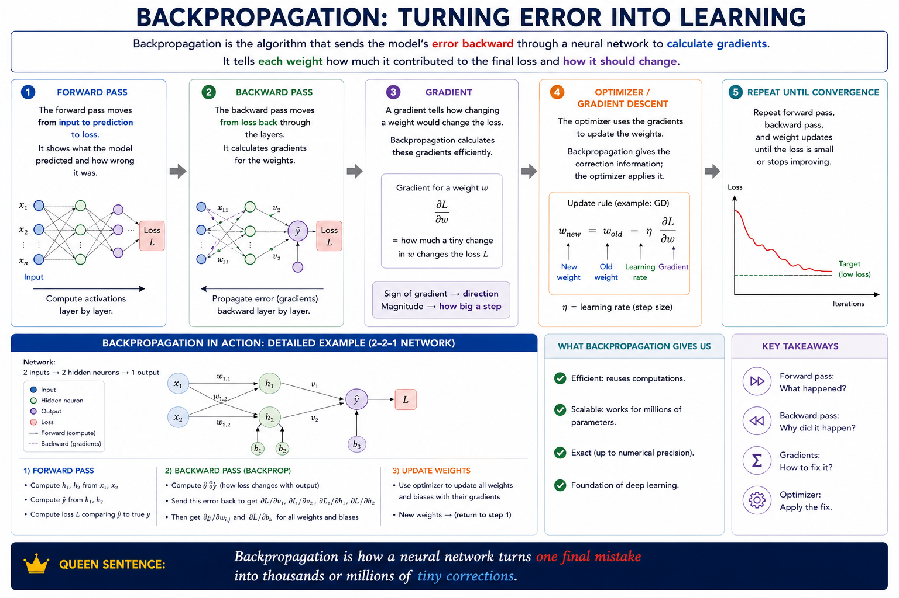

# Backpropagation

Backpropagation is the algorithm that sends the model’s error backward through a neural network to calculate gradients.

It tells each weight how much it contributed to the final loss and how it should change.

## Forward pass

The forward pass moves from input to prediction to loss.

It shows what the model predicted and how wrong it was.

`input --> prediction --> loss`

## Backward pass

The backward pass moves from loss back through the layers.

It calculates gradients for the weights.

## Gradient

A gradient tells how changing a weight would change the loss.

Backpropagation calculates these gradients efficiently.

## Optimizer / gradient descent

The optimizer uses the gradients to update the weights.

Backpropagation gives the correction information; the optimizer applies it.

**Backpropagation is how a neural network turns one final mistake into thousands or millions of tiny corrections.**

