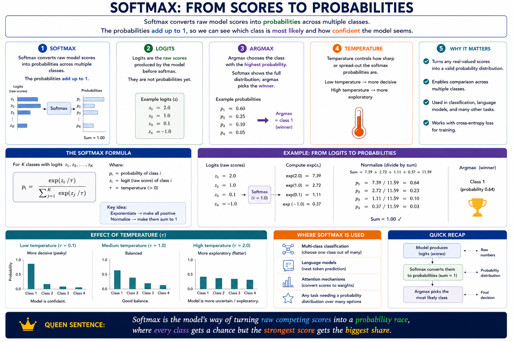

# Softmax

Softmax converts raw model scores into `probabilities` across multiple classes.

The probabilities add up to 1, so we can see which class is most likely and how confident the model seems.

## Logits

Logits are the raw scores produced by the model before softmax.

They are not probabilities yet.

## Argmax

Argmax chooses the class with t`he highest probability`.

Softmax shows the full probability distribution; argmax picks the winner.

## Temperature

Temperature controls how sharp or spread-out the softmax probabilities are.

Low temperature makes the model more `decisive`; high temperature makes it more `exploratory`.

**Softmax is the model’s way of turning raw competing scores into a probability race, where every class gets a chance but the strongest score gets the biggest share.**

