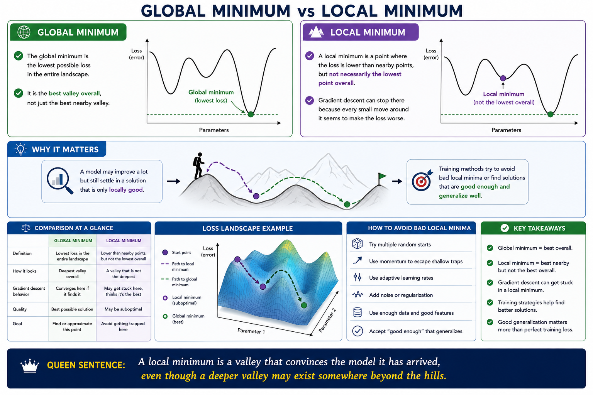

## Global minimum

The global minimum is the lowest possible loss in the entire landscape.

It is the best valley overall, not just the best nearby valley.

### Why it matters

A model may improve a lot but still settle in a solution that is only locally good.

Training methods try to avoid bad local minima or find solutions that are good enough and generalize well.

## Local minimum

A local minimum is a point where the loss is lower than nearby points, but not necessarily the lowest point overall.

Gradient descent can stop there because every small move around it seems to make the loss worse.

**A local minimum is a valley that convinces the model it has arrived, even though a deeper valley may exist somewhere beyond the hills. Local minimum**

