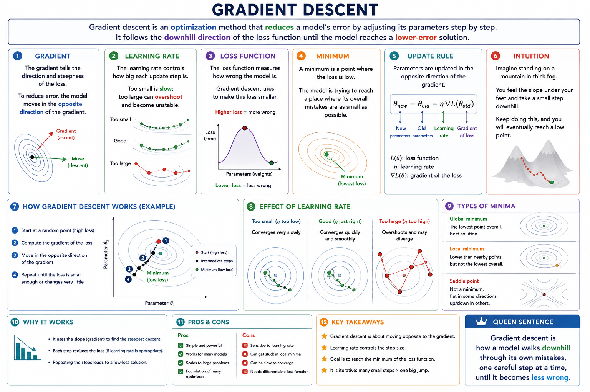

# Gradient descent

Gradient descent is an `optimization` method that reduces a model’s error by adjusting its `parameters` step by step.

It follows the downhill direction of the loss function until the model reaches a lower-error solution.

## Gradient

The gradient tells the direction and steepness of the loss.

To reduce error, the model moves in the opposite direction of the gradient.

## Learning rate

The learning rate controls how big each update step is.

Too small is slow; too large can overshoot and become unstable.

## Loss function

The loss function measures how wrong the model is.

Gradient descent tries to make this loss smaller.

## Minimum

A minimum is a point where the loss is low.

The model is trying to reach a place where its overall mistakes are as small as possible.

**Gradient descent is how a model walks downhill through its own mistakes, one careful step at a time, until it becomes less wrong.**

