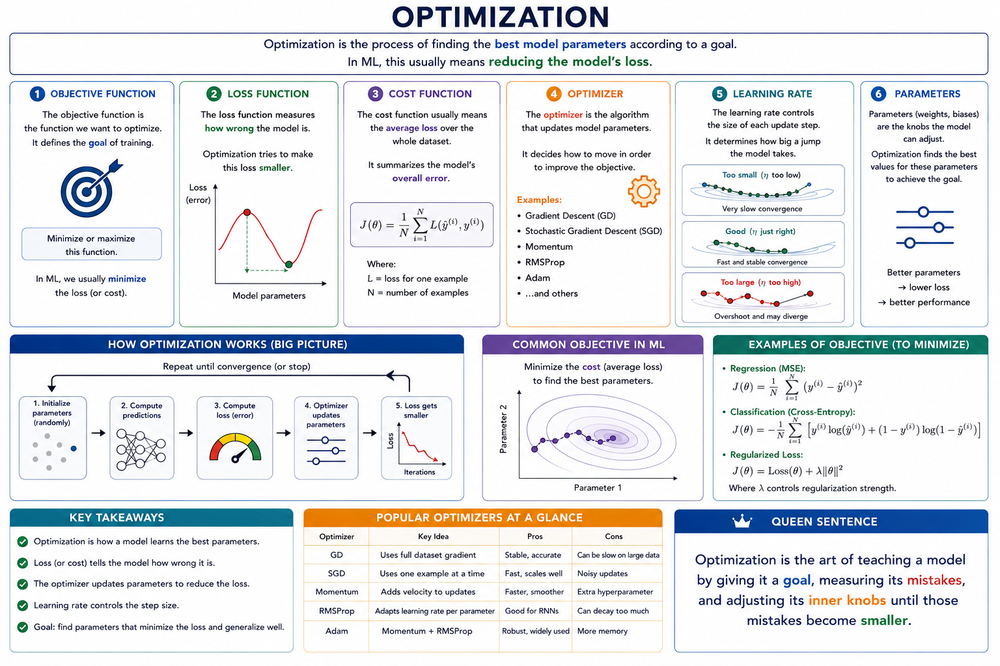

# Optimization

Optimization is the process of finding the `best model parameters` according to a `goal`.

In ML, this usually means `reducing` the model’s `loss`.

## Objective function

The objective function is the function we want to optimize.

It defines the goal of training.

## Loss function

The loss function measures how wrong the model is.

Optimization tries to make this loss smaller.

## Cost function

The cost function usually means the `average loss` over the whole dataset.

It summarizes the model’s overall error.

## Optimizer

The optimizer is the algorithm that updates model parameters.

Examples include gradient descent, SGD, momentum, RMSProp, and Adam.

## Learning rate

The learning rate controls the `size of each update step`.

Too small is slow; too large can overshoot.

**Optimization is the art of teaching a model by giving it a goal, measuring its mistakes, and adjusting its inner knobs until those mistakes become smaller.**
