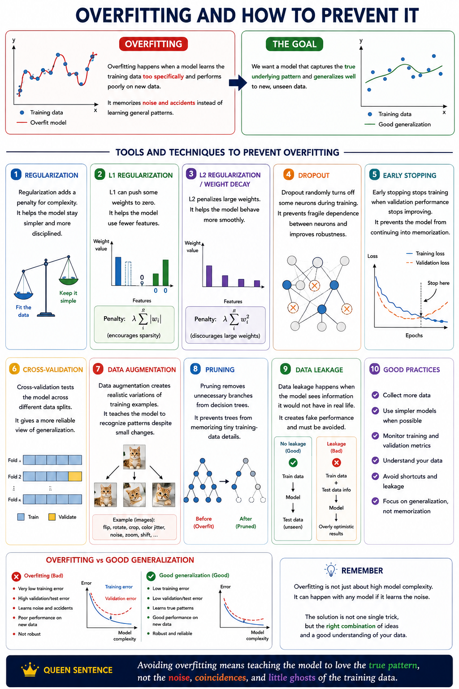

# Overfitting

Overfitting happens when a model learns the training data too specifically and performs poorly on new data.

It memorizes `noise` and `accidents` instead of learning general patterns.

## Regularization

Regularization adds a `penalty` for `complexity`.

It helps the model stay simpler and more disciplined.

## L1 regularization

L1 can push some weights to zero.

It helps the model use fewer features.

## L2 regularization / weight decay

L2 penalizes large weights.

It helps the model behave more smoothly.

## Dropout

Dropout randomly turns off some neurons during training.

It prevents fragile dependence between neurons and improves robustness.

## Early stopping

Early stopping stops training when validation performance stops improving.

It prevents the model from continuing into memorization.

## Cross-validation

Cross-validation tests the model across different data splits.

It gives a more reliable view of generalization.

## Data augmentation

Data augmentation creates realistic variations of training examples.

It teaches the model to recognize patterns despite small changes.

## Pruning

Pruning removes unnecessary branches from decision trees.

It prevents trees from memorizing tiny training-data details.

## Data leakage

Data leakage happens when the model sees information it would not have in real life.

It creates fake performance and must be avoided.

**Avoiding overfitting means teaching the model to love the true pattern, not the noise, coincidences, and little ghosts of the training data.**

