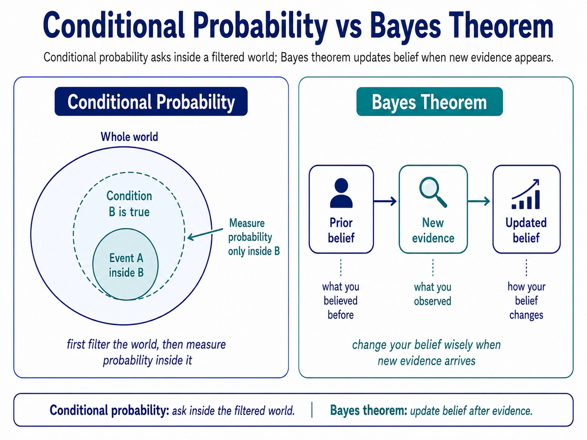

## Conditional probability

Conditional probability is the probability of something happening after we already know another condition is true.

It means we first filter the world, then calculate probability inside that filtered world.

Conditional probability means: don’t ask in the whole world; ask inside the world where the condition is already true.

## Bayes theorem

Bayes theorem tells us how to update a probability after we receive new information.

before evidence → evidence appears → updated belief

Bayes theorem updates the probability of a belief after new evidence appears.

It combines what we believed before, how well the evidence fits, and how common the evidence is overall.

**Bayes theorem is the mathematics of changing your mind wisely when new evidence arrives.**
