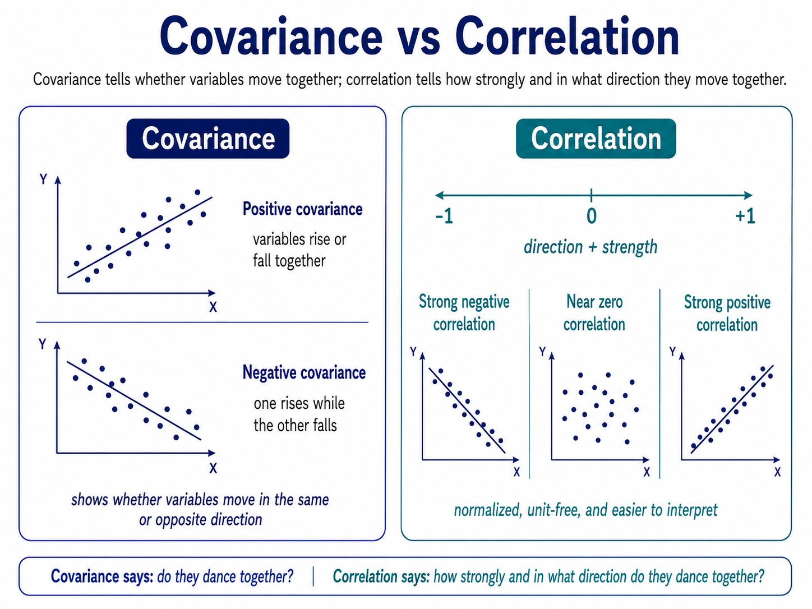

## Covariance

Covariance tells whether two variables move in the same direction or opposite directions.

Positive means they rise/fall together; negative means one rises while the other falls.

## Correlation

Correlation tells the direction and strength of that relationship on a standard scale from -1 to +1.

It is easier to interpret than covariance because it is normalized and unit-free.

**Covariance says:** do they dance together?

**Correlation says:** how strongly and in what direction do they dance together?
