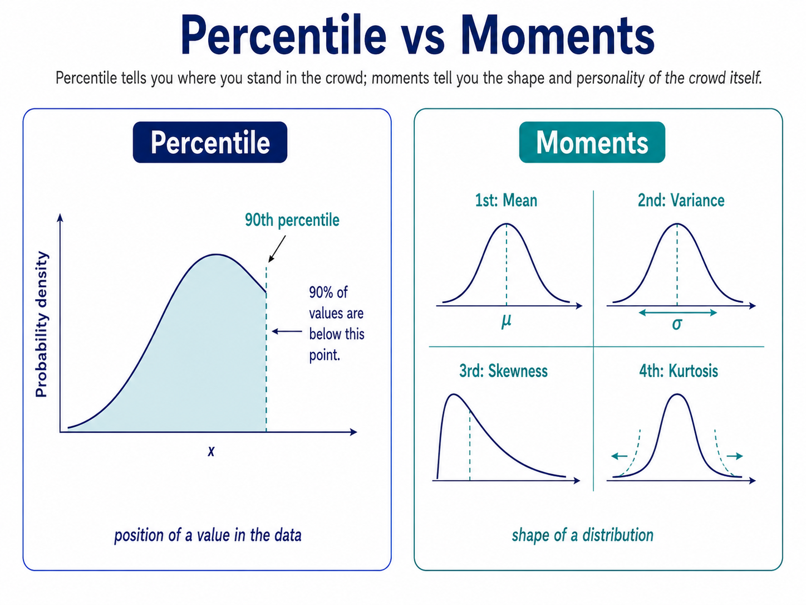

## Percentile

Percentile tells you the position of a value compared with the rest of the data.

The 90th percentile means 90% of values are below that value.

## Moments

Moments are measurements that describe the shape of a distribution.

The first four usually describe center, spread, skewness, and extreme tails.

Percentile tells you where you stand in the crowd; moments tell you the shape and personality of the crowd itself.

