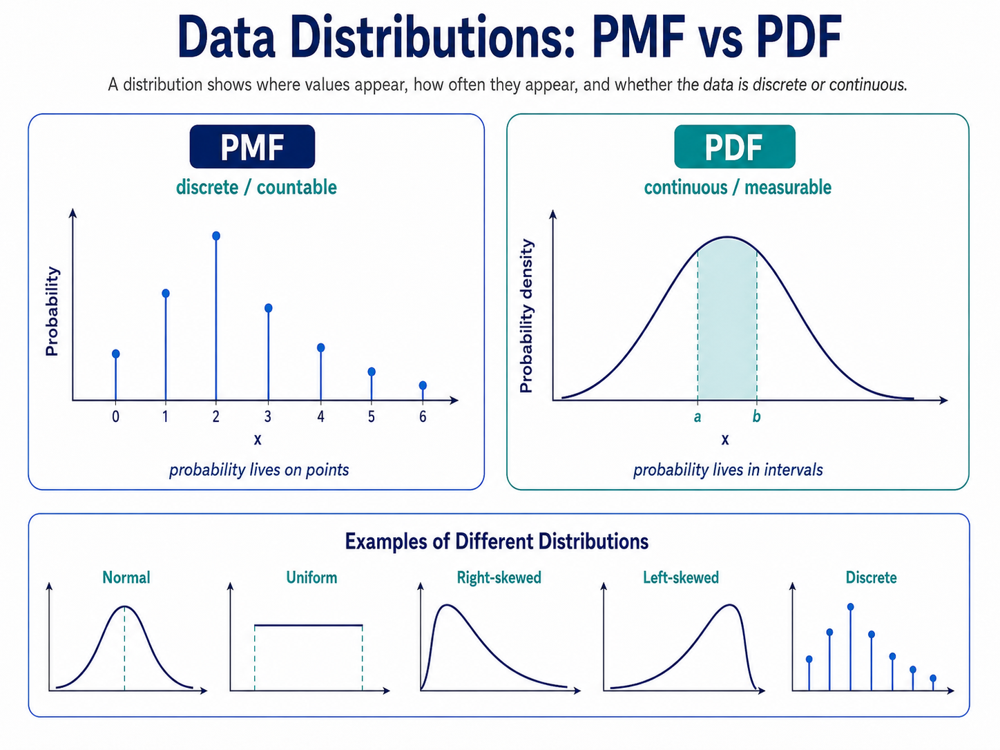

## PMF

Used for discrete/countable values.

It gives the probability of each exact value.

## PDF

Used for continuous/measurable values.

It gives probability through the area over an interval, not usually at one exact point.

PMF: probability lives on points.

PDF: probability lives in intervals.

