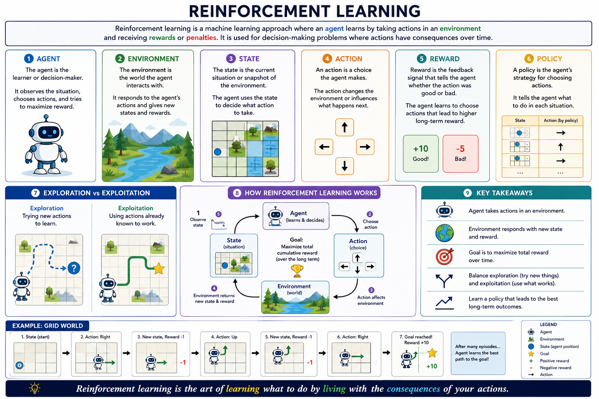

# Reinforcement learning

Reinforcement learning is a machine learning approach where an agent learns by `taking actions` in an environment and receiving `rewards` or `penalties`.

It is used for decision-making problems where actions have consequences over time.

## Agent

The agent is the learner or decision-maker.

It observes the situation, chooses actions, and tries to maximize reward.

## Environment

The environment is the world the agent interacts with.

It responds to the agent’s actions and gives new states and rewards.

## State

The state is the current situation or snapshot of the environment.

The agent uses the state to decide what action to take.

## Action

An action is a choice the agent makes.

The action changes the environment or influences what happens next.

## Reward

Reward is the feedback signal that tells the agent whether the action was good or bad.

The agent learns to choose actions that lead to higher long-term reward.

## Policy

A policy is the agent’s strategy for choosing actions.

It tells the agent what to do in each situation.

## Exploration vs exploitation

Exploration means trying new actions to learn.

Exploitation means using actions already known to work.

**Reinforcement learning is the art of learning what to do by living with the consequences of your actions.**

