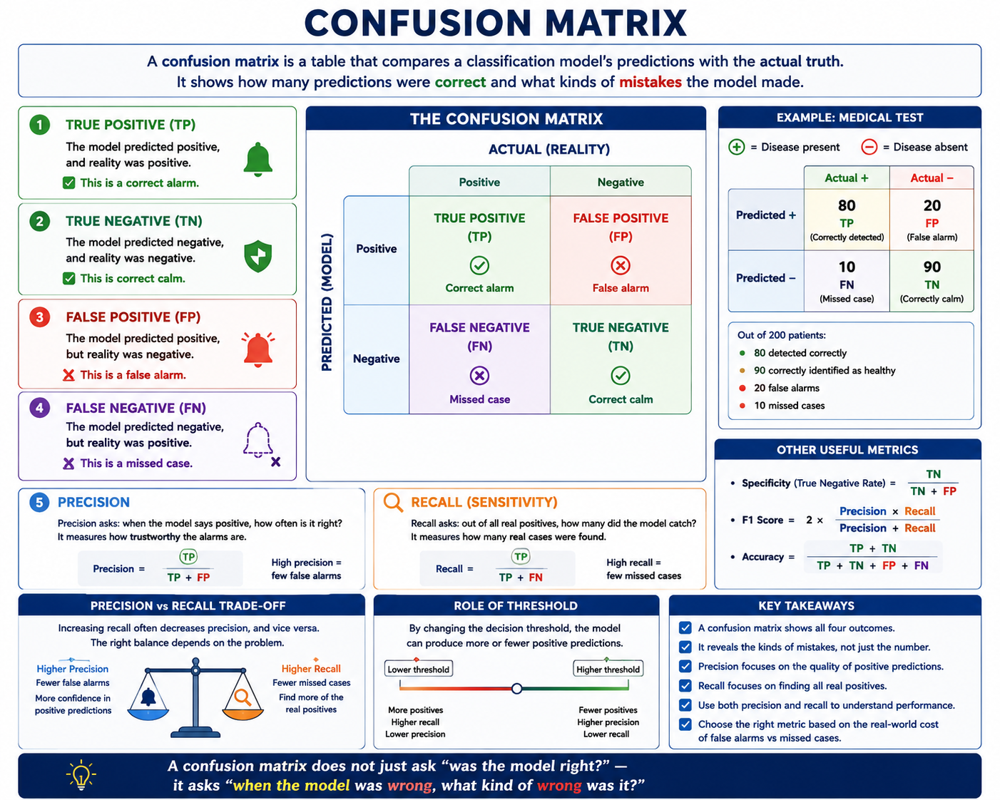

# Confusion matrix

A confusion matrix is a table that compares:
a classification model’s predictions 
with 
* the actual truth.

It shows how many predictions were correct and what kinds of mistakes the model made.

## True positive
`1 1`
The model predicted positive, and reality was positive.

This is a correct alarm.

## True negative
`0 0`
The model predicted negative, and reality was negative.

This is correct calm.

## False positive
`1 0`
The model predicted positive, but reality was negative.

This is a false alarm.

## False negative
`0 1`
The model predicted negative, but reality was positive.

This is a missed case.

## Precision

Precision asks: when the model says positive, `how often is it right?`

It measures how trustworthy the alarms are.

## Recall

Recall asks: out of all real positives, `how many did the model catch?`

It measures how many real cases were found.

## Queen sentence

**A confusion matrix does not just ask “was the model right?” — it asks “when the model was wrong, what kind of wrong was it?”**
