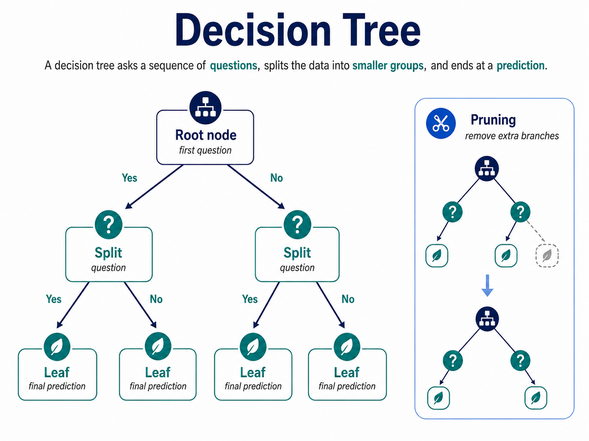

## Decision tree

A decision tree is a supervised learning model that predicts by asking a sequence of questions.

Each question splits the data into smaller groups until the model reaches a final prediction.

## Root node

The root node is the first question in the tree.

It makes the first major split in the data.

## Leaf node

A leaf node is the final endpoint of a path.

It contains the model’s final prediction.

## Split

A split is a question that divides the data into groups.

A good split makes the groups cleaner, more meaningful, or easier to predict.

## Pruning

Pruning means cutting unnecessary branches from the tree.

It helps prevent overfitting and keeps the model more general.

**A decision tree is machine learning in the shape of common sense: ask the right questions, follow the answers, and arrive at a prediction.**
