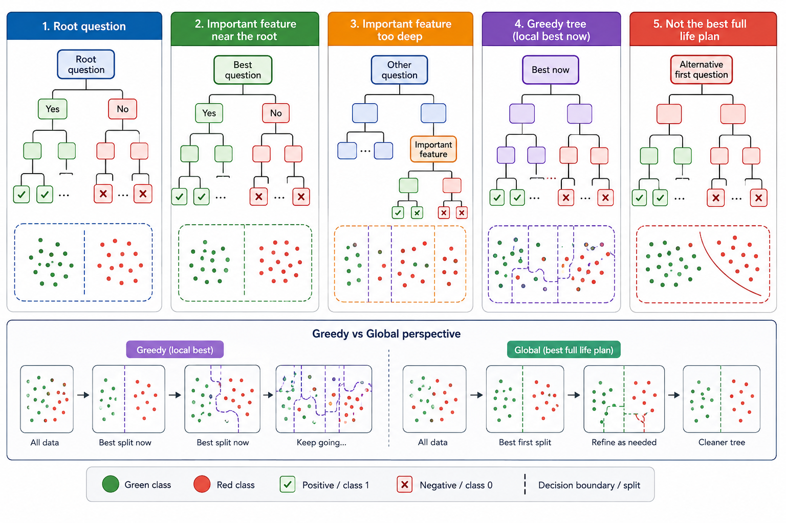

## Root question

The root question is the first and most influential split in a decision tree.

If it separates the data well, the whole tree becomes cleaner and simpler.

## Important feature near the root

A globally important feature near the root can reduce confusion early and improve prediction.

It prevents the model from mixing fundamentally different groups.

## Important feature too deep

If a major feature appears too deep, the tree may already have fragmented the data.

The feature then works only on smaller subsets and may be weakened, missed, or pruned.

## Greedy tree

A decision tree usually chooses the best split at the current moment, not the best full life plan.

That makes it efficient, but sometimes unstable or short-sighted.

**In a decision tree, the first question decides the first universe; if that universe is wrong, every later question has to repair the confusion.**
