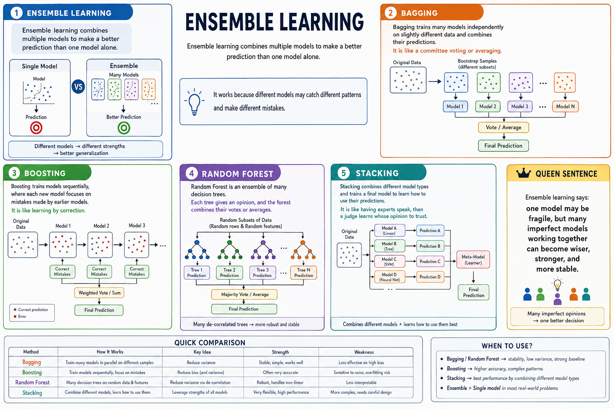

## Ensemble learning

Ensemble learning combines multiple models to make a better prediction than one model alone.

It works because different models may catch different patterns and make different mistakes.

## Bagging

Bagging trains many models `independently` on slightly different data and combines their predictions.

It is like a committee voting or averaging.

## Boosting

Boosting trains models `sequentially`, where each new model focuses on mistakes made by earlier models.

It is like learning by correction.

## Random Forest

Random Forest is an ensemble of many decision trees.

Each tree gives an opinion, and the forest combines their votes or averages.

## Stacking

Stacking combines different model types and trains a final model to learn how to use their predictions.

It is like having experts speak, then a judge learns whose opinion to trust.

**Ensemble learning says: one model may be fragile, but many imperfect models working together can become wiser, stronger, and more stable.**
