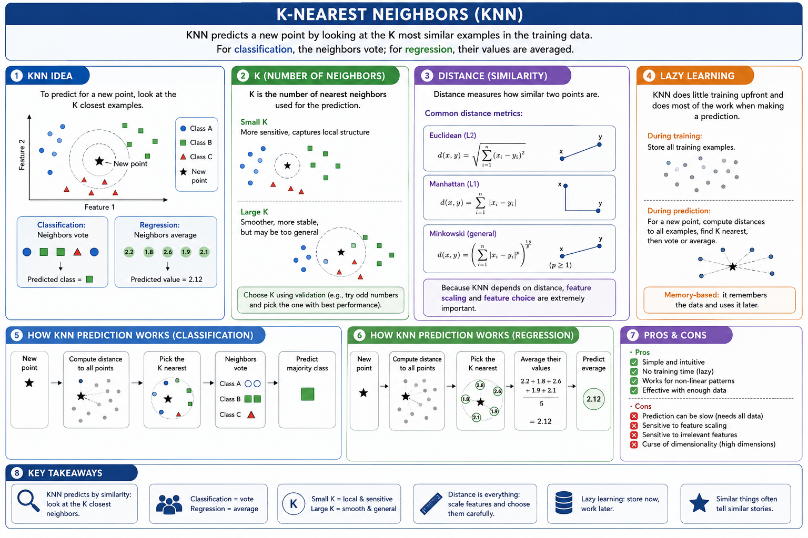

# K-nearest neighbors

KNN predicts a new point by looking at the K most similar examples in the training data.

For classification, the neighbors vote; for regression, their values are averaged.

## K

K is the number of nearest neighbors used for the prediction.

Small K is more sensitive and local; large K is smoother but may become too general.

## Distance

Distance measures how similar two points are.

Because KNN depends on distance, feature scaling and feature choice are extremely important.

## Lazy learning

KNN does little training upfront and does most of the work when making a prediction.

It stores the examples and compares new cases to them later.

**KNN says: to understand a new point, look at its closest neighbors — because similar things often tell similar stories.**
