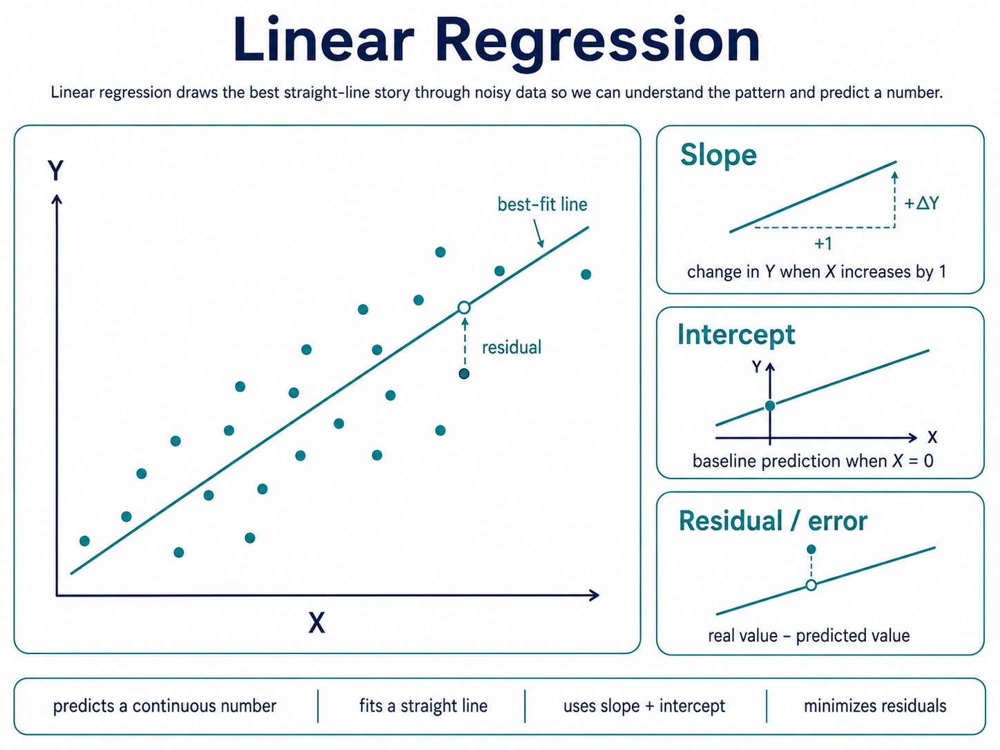

## Linear regression

Linear regression predicts a continuous number by fitting the best straight line through data.

It learns how much `Y` tends to change when `X `changes, then uses that line to make predictions.

## Slope

Slope tells how much the prediction changes when the input increases by one unit.

Positive slope means `Y` tends to rise; negative slope means `Y` tends to fall.

## Intercept

Intercept is the baseline prediction when the input is zero.

It is mathematically useful, but not always meaningful in real life.

## Residual / error

Residual is the gap between the real value and the predicted value.

Linear regression tries to choose the line that makes these gaps as small as possible overall.

**Linear regression draws the best straight-line story through noisy data, so we can understand the pattern and predict a number.**
