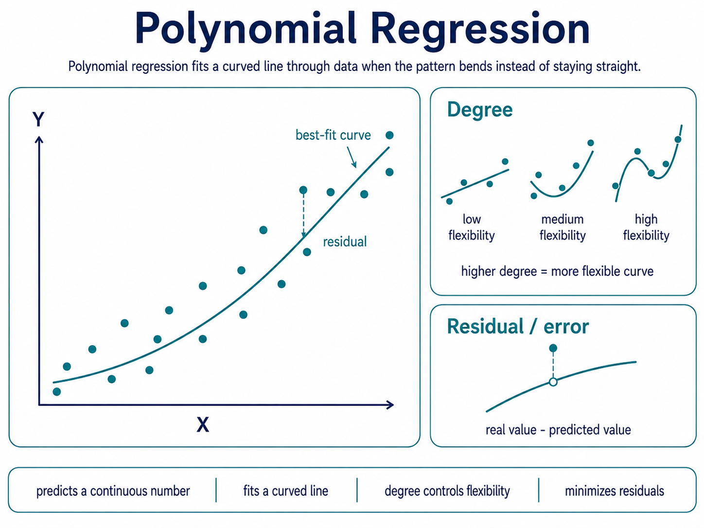

# Polynomial regression

Polynomial regression predicts a continuous number by fitting a curved line through data.

It is useful when `the relationship between input and output bends instead of following one straight-line pattern.`

## Degree

The degree tells how flexible the curve is.

Higher degree can capture more bends, but `too much flexibility can overfit the data.`

## Residual / error

Residual is still the gap between real value and predicted value.

Polynomial regression tries to choose the curve that makes these gaps small.

**Polynomial regression is linear regression’s more flexible cousin: it says reality may not walk in a straight line; sometimes it bends.**
