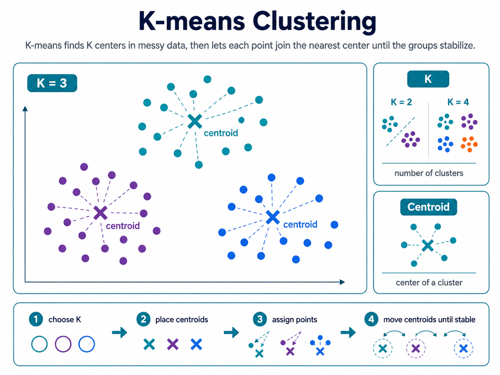

# K-means clustering

K-means is an unsupervised learning algorithm that divides data into K groups based on similarity.

It finds K centroids, assigns each point to the nearest centroid, then keeps moving the centroids until the groups stabilize.

## K

K is the number of clusters we ask the algorithm to find.

Choosing K too small oversimplifies the data; choosing it too large can create unnecessary groups.

## Centroid

A centroid is the center or average point of a cluster.

Each data point belongs to the cluster whose centroid is closest.

**K-means is like finding K centers of gravity in messy data, then letting every point join the nearest center.**
