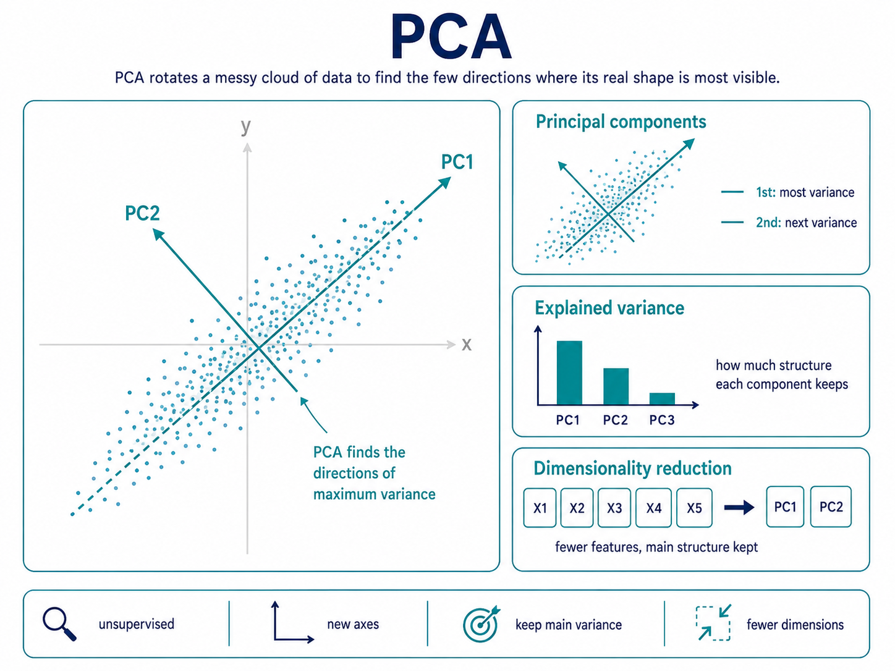

# PCA

PCA is an unsupervised dimensionality reduction method that transforms many features into fewer new components.

It keeps the directions where the data varies the most, so we preserve the main shape of the data.

## Principal component

A principal component is a new axis made from a combination of original features.

The first component captures the largest direction of variation; the second captures the next largest separate direction.

## Explained variance

Explained variance tells how much of the original data’s spread is captured by each component.

Higher explained variance means that component preserves more of the data’s important structure.

## Dimensionality reduction

Dimensionality reduction means simplifying data from many features into fewer features.

The goal is to reduce complexity while keeping as much useful information as possible.

**PCA is like rotating a messy cloud of data until you find the few directions where its real shape is most visible.**
